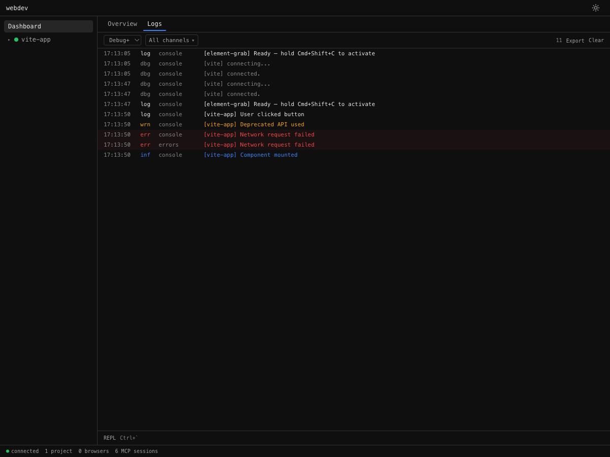
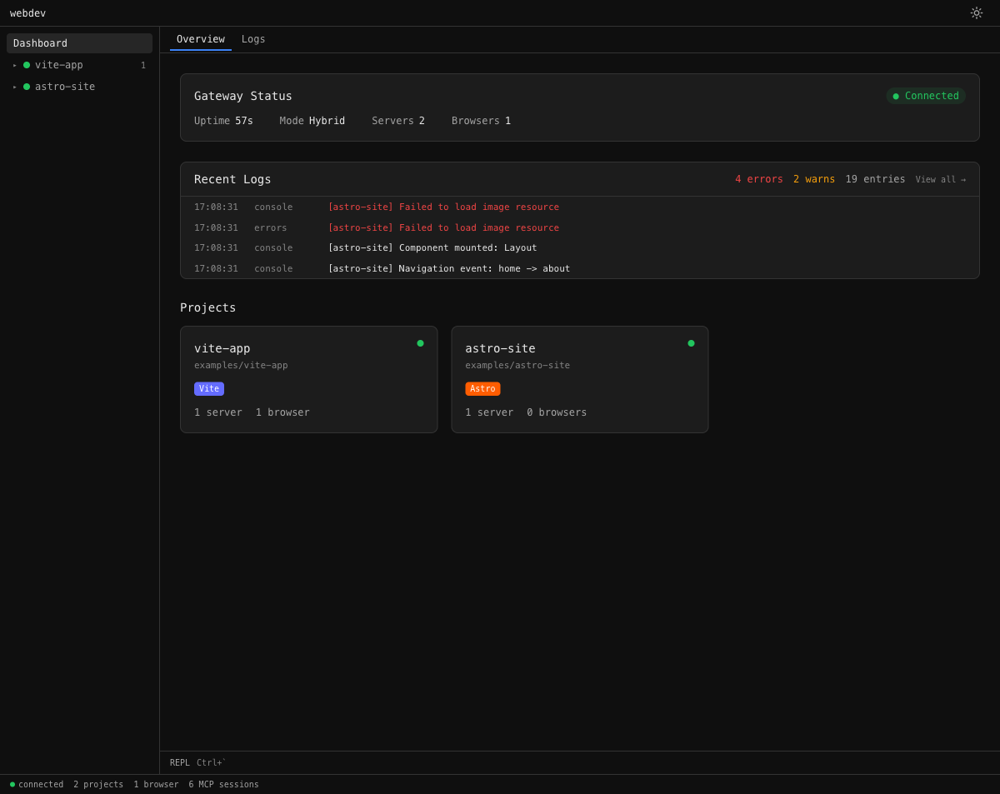
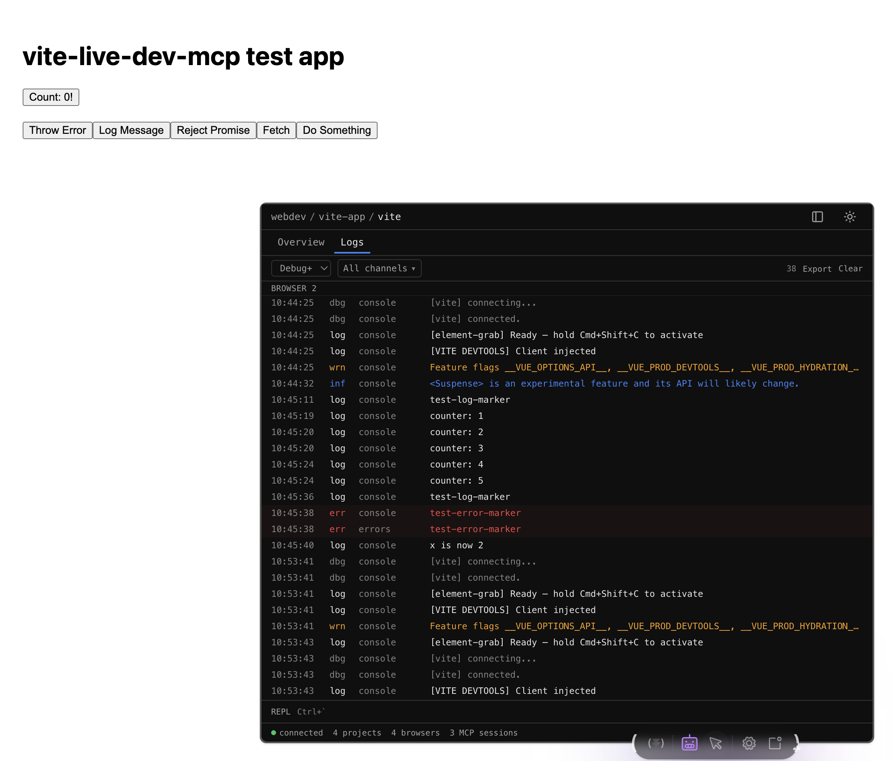
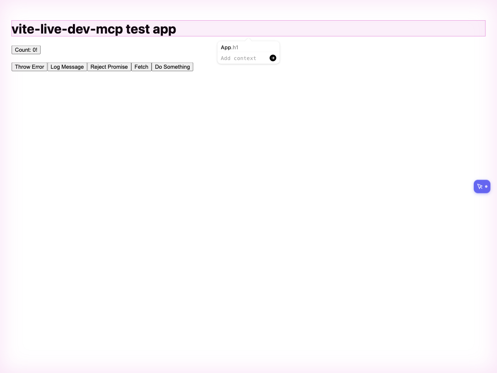

# webdev

<table>
  <tr>
    <td></td>
    <td></td>
    <td></td>
    <td></td>
  </tr>
</table>

A dev sidecar that gives AI agents live access to your browser during development. The agent sees what you see — console logs, DOM, screenshots, form state — through your existing browser tab, with your auth, your state, your HMR.

Not a browser automation tool. For that, use Playwright. This is for the dev loop: edit code → check the browser → fix → repeat.

## Supports

Vite · Next.js · Astro · Storybook · TanStack Start · SvelteKit · any dev server via proxy or script tag. See [docs/compatibility.md](docs/compatibility.md) for per-framework status.

Works with Claude Code, Cursor, Windsurf, VS Code Copilot, and any agent that supports MCP.

## Setup

Four steps. See **[setup.md](setup.md)** for the full guide.

| Step | What |
|------|------|
| 1 | Install the gateway: `npm install -g @winstonfassett/webdev-gateway` |
| 2 | Wire the adapter for your framework (Vite, Next.js, Astro, Storybook, or script tag) |
| 3 | Register the MCP server with your agent: `npx @winstonfassett/webdev-gateway register --global` |
| 4 | Add the skill (Claude Code only): `npx skills add WinstonFassett/webdev --all` |

Start your dev server, open your app in a browser, and your agent has browser access.

### Chrome extension (optional)

Upgrades `browser_*` tools to Playwright-quality CDP — pixel-perfect screenshots and reliable locators. See [apps/extension/README.md](apps/extension/README.md).

## MCP Tools

Six tools. `eval_js` does most of the work.

**`get_diagnostics`** — console logs, errors, network activity, and HMR/build status in one call.

**`clear`** — reset logs. Call before a code change.

**`eval_js`** — run JavaScript directly in the browser. Full DOM access, multi-statement, supports await. Includes `browser.*` helpers for common operations (click, fill, screenshot, markdown).

**`get_element_context`** — component name, source location, and CSS selector for any element grabbed with `Cmd+Shift+C`.

**`set_project`** / **`list_projects`** / **`list_browsers`** — multi-project management.

Full toolset (23 tools): `/__mcp/sse?tools=full`

## Examples

See [`examples/`](examples/) for working setups: Vite, TanStack Start, Astro, Next.js (Turbopack + Webpack), Storybook, and plain HTML.

## License

MIT
