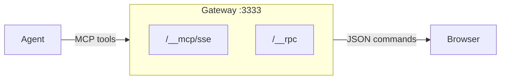
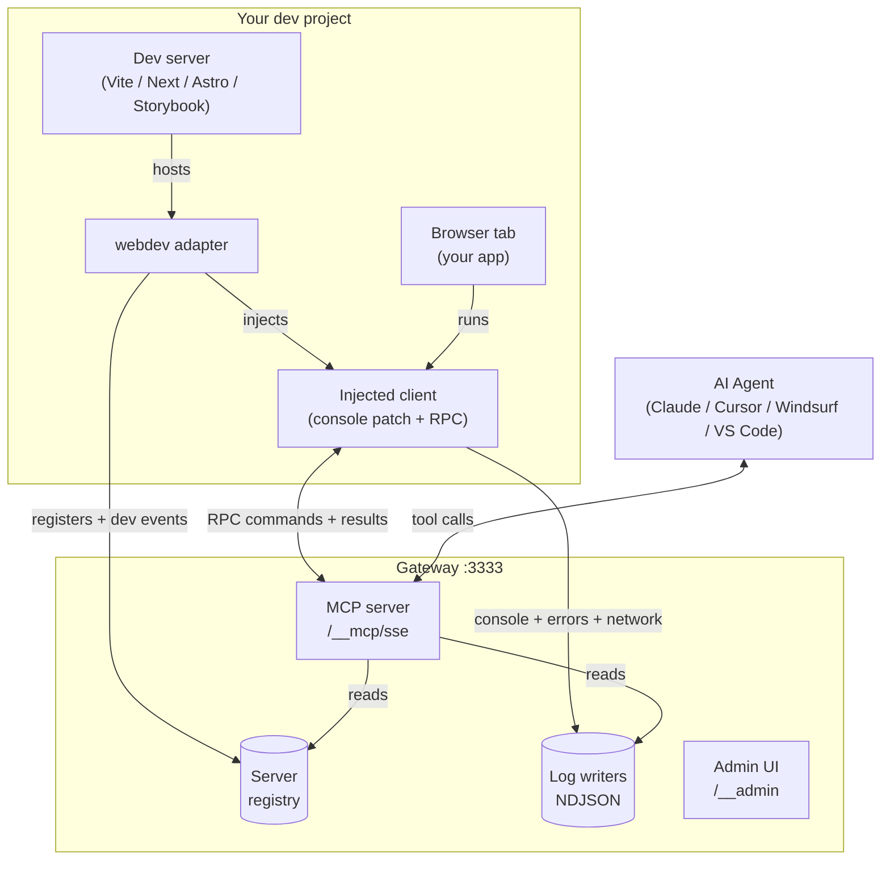
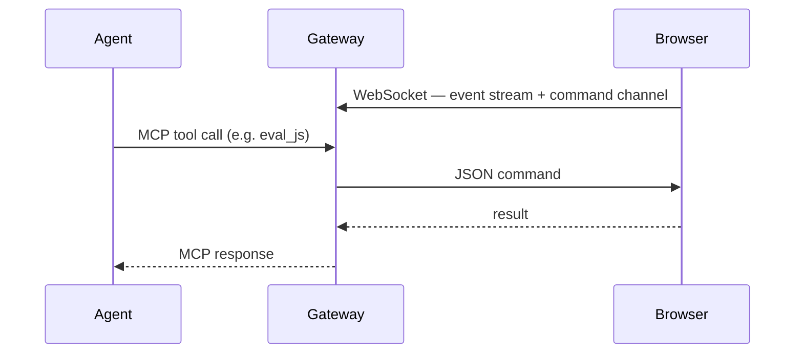

# webdev


A dev sidecar that gives AI agents live access to your browser during development. The agent sees what you see — console logs, DOM, screenshots, form state — through your existing browser tab, with your auth, your state, your HMR.

Not a browser automation tool. For that, use Playwright. This is for the dev loop: edit code → check the browser → fix → repeat.



## Quick Start

In your project directory:

```bash
npx webdev init
```

That detects your framework (Vite, Next.js, Astro, Storybook), wires the adapter into your config, installs the dev dependencies, and writes MCP server config for Claude / Cursor / Windsurf / VS Code.

Then start your dev server as usual (`npm run dev`). The adapter auto-starts the gateway. Open the page in your browser, connect your agent — done.

```json
// .mcp.json (written by `init`)
{
  "mcpServers": {
    "webdev": {
      "url": "http://localhost:3333/__mcp/sse"
    }
  }
}
```

If you only need MCP registration (e.g. you've already wired your config manually):

```bash
npx webdev register          # project-level
npx webdev register --global # user-level (~/.claude, ~/.cursor)
```

See [getting-started.md](getting-started.md) for the full setup guide and manual install.

## MCP Tools (core)

Six tools. `eval_js` does most of the work.

**`get_diagnostics`** — console logs + errors + network + HMR/build status in one call. Use `since_checkpoint: true` after `clear` for clean reads.

**`clear`** — reset logs. Call before a code change.

**`eval_js`** — run JavaScript directly in the browser. Full DOM access, multi-statement, supports await. Promises auto-awaited. Accepts `string | string[]` — array of steps auto-waits for DOM to settle between each.

```js
// Read the page as markdown
eval_js: return browser.markdown('#main')

// Click by visible text
eval_js: browser.click('text=Submit')

// Fill a form
eval_js: browser.fill('#email', 'test@example.com')

// Take a screenshot
eval_js: return browser.screenshot('#my-component')

// DOM traversal
eval_js: |
  const link = document.querySelector('a[href*="doom"]')
  const row = link.closest('tr').nextElementSibling
  return row.querySelector('a:last-child').href

// Store refs across calls
eval_js: state.heading = document.querySelector('h1'); return state.heading.textContent
eval_js: return state.heading.getAttribute('class')

// Auto-waited pipeline (array of steps)
eval_js: ["browser.click('text=Submit')", "return document.querySelector('.toast').textContent"]
```

**`set_project`** / **`list_projects`** / **`list_browsers`** — multi-project management.

Full tools available at `/__mcp/sse?tools=full` (23 tools including click, fill, screenshot, navigate, query_dom, etc. as individual tools).

## Install (manual — `init` does all this for you)

Pick the adapter for your framework. Each one auto-starts the gateway.

### Vite (incl. TanStack Start, SvelteKit dev mode)

```bash
npm install -D @winstonfassett/webdev-vite @winstonfassett/webdev-gateway
```

```ts
// vite.config.ts
import { webdev } from '@winstonfassett/webdev-vite'

export default defineConfig({
  plugins: [react(), webdev()],
})
```

### Storybook

```ts
// .storybook/main.ts
export default {
  addons: ['@winstonfassett/webdev-vite/storybook'],
}
```

### Next.js

```bash
npm install -D @winstonfassett/webdev-next @winstonfassett/webdev-gateway
```

```js
// next.config.js
import { withWebdev } from '@winstonfassett/webdev-next'

export default withWebdev(nextConfig)
```

For Turbopack, also add the client component to your root layout:

```tsx
// app/layout.tsx
import { WebdevInit } from '@winstonfassett/webdev-next/init'
// ... add <WebdevInit /> as a child of <body>
```

### Astro

```bash
npm install -D @winstonfassett/webdev-astro @winstonfassett/webdev-gateway
```

```js
// astro.config.mjs
import webdev from '@winstonfassett/webdev-astro'

export default defineConfig({
  integrations: [webdev()],
})
```

## How to connect

**Framework adapters** (recommended): Vite and Next.js adapters inject the client script and forward HMR/build events to the gateway.

**Proxy plugin** (`npm install @winstonfassett/webdev-proxy`): browse `http://localhost:3333/http://any-url/` to proxy and instrument any page. Works with any dev server or website.

**Manual**: add `<script src="http://localhost:3333/__webdev.js"></script>` to your HTML.

## How it works

Three actors, one local gateway holding them together.



A single tool call goes through it like this:



The injected client script:
- Patches `console.*`, `fetch`, `XMLHttpRequest` to relay events to NDJSON log files
- Connects to `/__rpc` via WebSocket for JSON commands
- Handles commands: eval, screenshot, click, fill, navigate, queryDom, markdown, etc.

When the browser extension is installed, the gateway upgrades the same `browser_*` tools to Playwright via CDP — pixel-perfect screenshots and reliable locators, transparent to the agent.

## License

MIT
