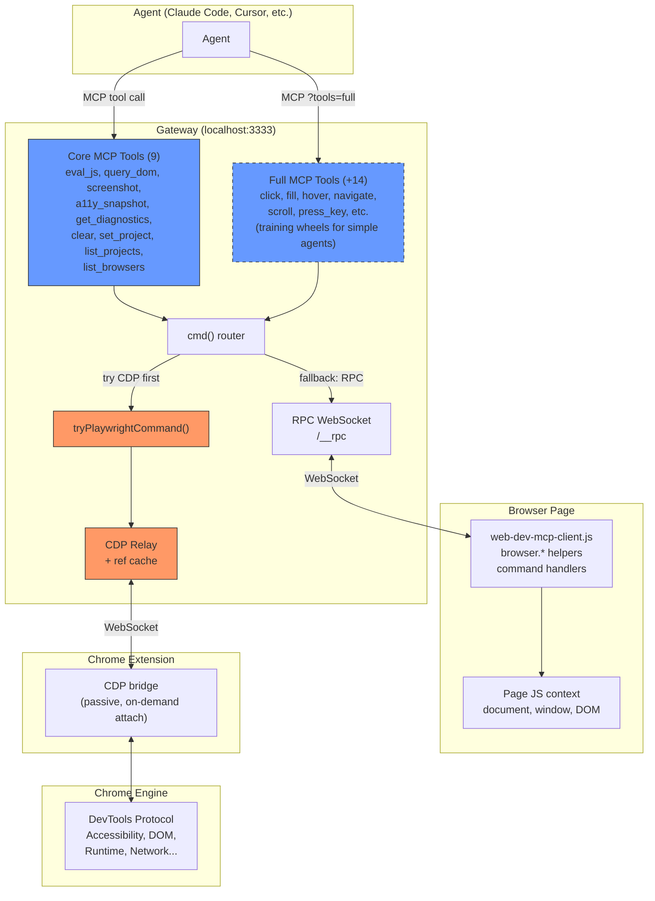
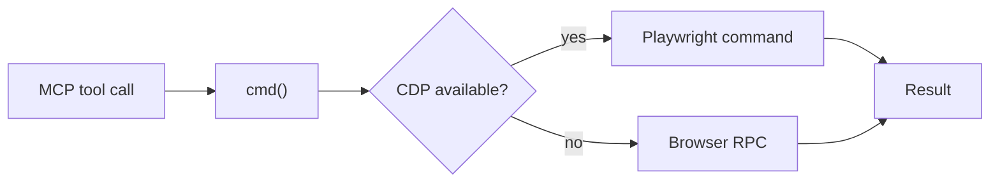
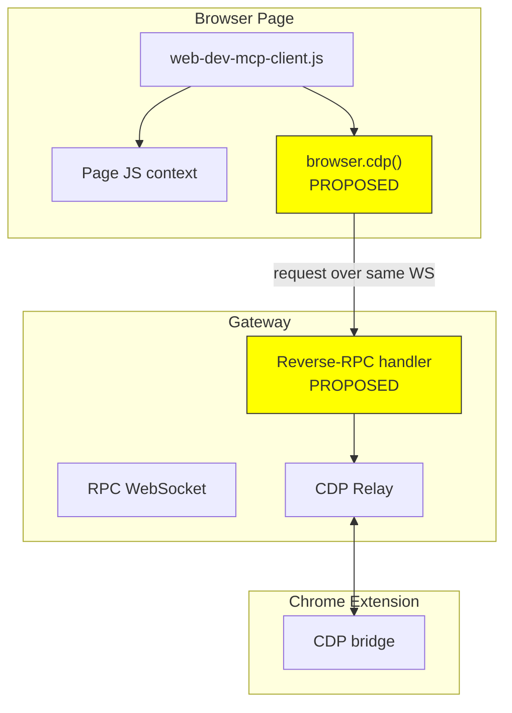
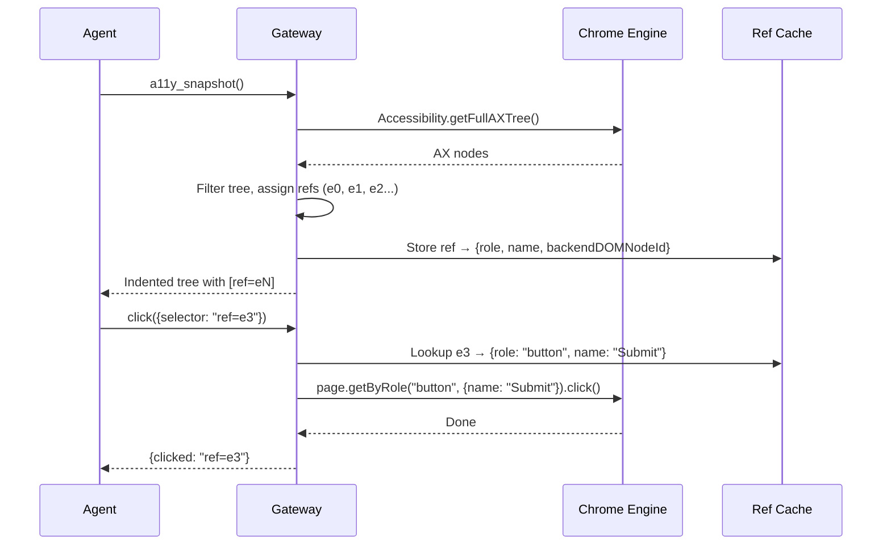

# web-dev-mcp Communication Architecture

## Current State: Two Paths to the Browser



### Path 1: RPC (browser-side execution)

Agent → eval_js or query_dom → cmd() → RPC WebSocket → browser client → page JS

- Can do anything in the page: DOM, localStorage, framework state
- `browser.*` helpers: `.click()`, `.fill()`, `.screenshot()`, `.markdown()`, `.navigate()`, `.waitFor()`
- **Cannot** reach Chrome engine APIs (a11y tree, network layer, etc.)

### Path 2: CDP (engine-side execution)

Agent → a11y_snapshot or screenshot → cmd() → tryPlaywrightCommand() → CDP relay → extension → Chrome engine

- Pixel-perfect screenshots via Playwright
- Accessibility tree via `Accessibility.getFullAXTree()`
- Ref-based element interaction (a11y_snapshot assigns refs, click/fill/hover accept `ref=eN`)
- Requires Chrome extension to be installed and connected
- Falls back to RPC path when extension unavailable

### How cmd() routes

Every MCP tool goes through `cmd()`. It tries Playwright/CDP first. If CDP unavailable or the command isn't implemented in Playwright, it falls back to browser-side RPC. This is transparent to the agent.



---

## Tool Inventory

### Core (9 tools, always available at `/__mcp/sse`)

| Tool | Path | What it does |
|------|------|-------------|
| `eval_js` | RPC | Run JS in browser. The universal tool. |
| `query_dom` | RPC | Pruned DOM tree. `visible_only` (default true) filters hidden elements. |
| `screenshot` | CDP or RPC | Saves to file, returns path. Presets: viewport/element/full/thumb/hd. |
| `a11y_snapshot` | CDP only | A11y tree with ref IDs on interactive elements. CDP extension required. |
| `get_diagnostics` | Server | Browser logs + server logs + build status. |
| `clear` | Server | Truncate logs, set checkpoint. |
| `set_project` | Server | Set current project (multi-project support). |
| `list_projects` | Server | List registered dev servers. |
| `list_browsers` | Server | List connected browsers. |

### Full (+14 tools, at `/__mcp/sse?tools=full`)

These duplicate what `eval_js` + `browser.*` can do. They exist for agents that can't write JS.

| Tool | Equivalent eval_js |
|------|-------------------|
| `click` | `browser.click(sel)` |
| `fill` | `browser.fill(sel, val)` |
| `hover` | via Playwright only |
| `select_option` | DOM directly |
| `press_key` | `dispatchEvent` |
| `navigate` | `browser.navigate(url)` |
| `go_back` | `history.back()` |
| `go_forward` | `history.forward()` |
| `scroll` | `scrollTo()` / `scrollIntoView()` |
| `get_visible_text` | `el.innerText` |
| `get_page_markdown` | `browser.markdown()` |
| `wait_for_condition` | `browser.waitFor()` |
| `get_session_info` | Server-side state |
| `get_build_status` | Server-side (overlaps get_diagnostics) |
| `get_logs` | Server-side (overlaps get_diagnostics) |

---

## The Gap: eval_js Can't Reach CDP

eval_js runs code in the page's JS context. CDP commands go to the browser engine through a separate channel. They don't talk to each other.

This means any CDP-powered feature (a11y tree, network interception, etc.) requires either:
1. A dedicated MCP tool (current approach for `a11y_snapshot`)
2. A reverse-RPC bridge (proposed below)

### Proposed: browser.cdp() Reverse-RPC Bridge



Browser client sends a CDP request back to the gateway over the existing WebSocket. Gateway runs it through the relay, returns result. One helper, any CDP command:

```js
// via eval_js — no MCP tool needed
const { nodes } = await browser.cdp('Accessibility.getFullAXTree')
const metrics = await browser.cdp('Performance.getMetrics')
```

**Status:** Not built yet. Would eliminate the need for CDP-specific MCP tools entirely.

---

## Ref-Based Interaction Flow



Refs are assigned fresh on each `a11y_snapshot` call. Cache lives on CDPRelay, bounded by page element count (typically 10-100 entries). Dies on disconnect.
