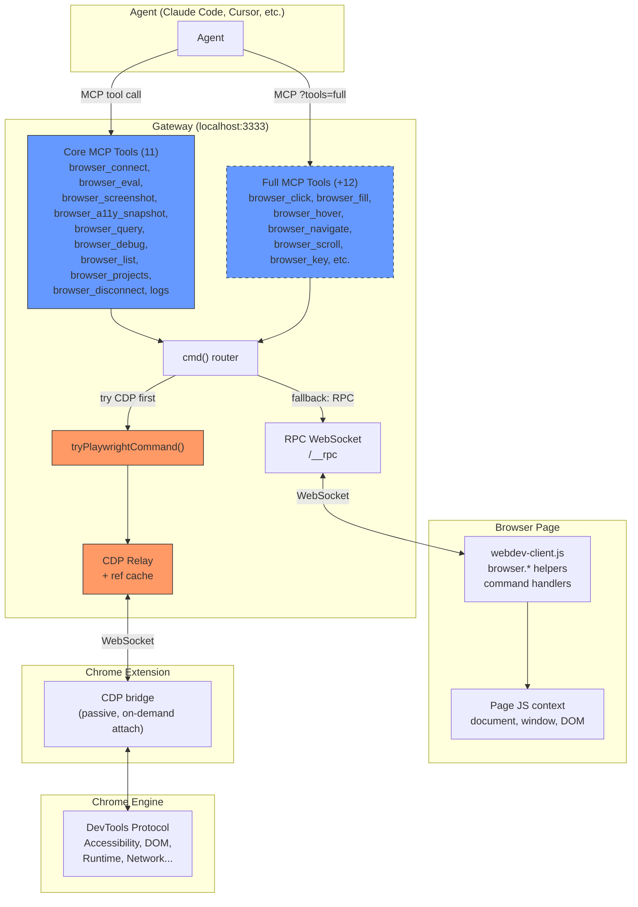
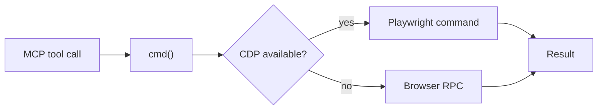
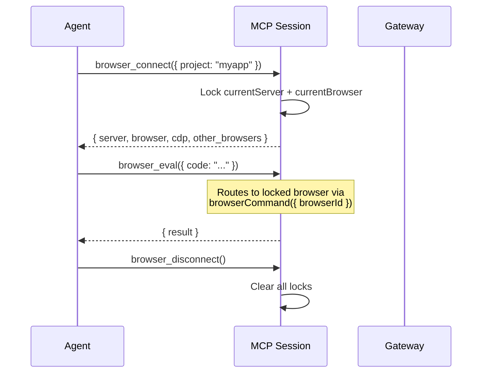
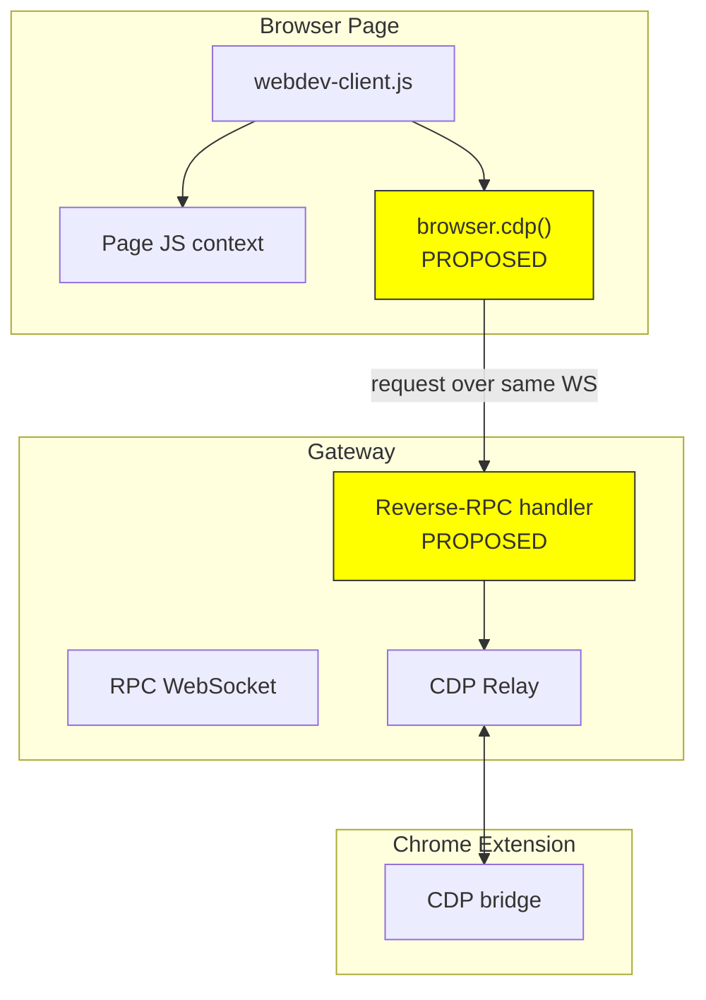
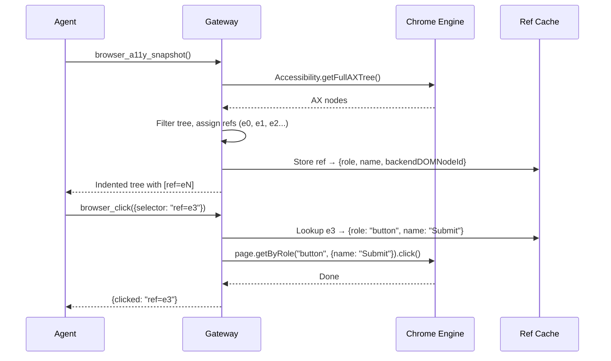

# webdev-mcp Communication Architecture

## Two Paths to the Browser



### Path 1: RPC (browser-side execution)

Agent → browser_eval or browser_query → cmd() → RPC WebSocket → browser client → page JS

- Can do anything in the page: DOM, localStorage, framework state
- `browser.*` helpers: `.click()`, `.fill()`, `.screenshot()`, `.markdown()`, `.navigate()`, `.waitFor()`
- **Cannot** reach Chrome engine APIs (a11y tree, network layer, etc.)

### Path 2: CDP (engine-side execution)

Agent → browser_a11y_snapshot or browser_screenshot → cmd() → tryPlaywrightCommand() → CDP relay → extension → Chrome engine

- Pixel-perfect screenshots via Playwright
- Accessibility tree via `Accessibility.getFullAXTree()`
- Ref-based element interaction (a11y_snapshot assigns refs, click/fill/hover accept `ref=eN`)
- Requires Chrome extension to be installed and connected
- Falls back to RPC path when extension unavailable
- Agent controls via `browser_debug({ action: "start" | "stop" | "status" })`

### How cmd() routes

Every MCP tool goes through `cmd()`. It tries Playwright/CDP first. If CDP unavailable or the command isn't implemented in Playwright, it falls back to browser-side RPC. This is transparent to the agent.



---

## Session Locking

MCP sessions lock to a specific server + browser via `browser_connect`. All subsequent commands go to that exact browser.



If no explicit `browser_connect`, first command auto-resolves (single server + latest browser). Multiple servers → error with list.

---

## Tool Inventory

### Core (11 tools, always available at `/__mcp/sse`)

| Tool | Path | What it does |
|------|------|-------------|
| `browser_connect` | Server | Lock session to a server + browser. Returns server info, browser info, CDP status. |
| `browser_disconnect` | Server | Release session locks. |
| `browser_list` | Server | List connected browsers with server affiliation. |
| `browser_projects` | Server | List registered servers with endpoints and browser counts. |
| `browser_debug` | Server | Start/stop/status CDP debugging. |
| `browser_eval` | RPC | Run JS in browser. The universal tool. |
| `browser_screenshot` | CDP or RPC | Saves to file, returns path. |
| `browser_a11y_snapshot` | CDP only | A11y tree with ref IDs on interactive elements. |
| `browser_query` | RPC | Pruned DOM tree. `visible_only` (default true). |
| `logs` | Server | Browser logs + server logs + build status. Get or clear. |
| `get_element_context` | RPC | Element-grab: source location for selected elements. |

### Full (+12 tools, at `/__mcp/sse?tools=full`)

These duplicate what `browser_eval` + `browser.*` helpers can do. They exist for agents that can't write JS.

| Tool | Equivalent browser_eval |
|------|------------------------|
| `browser_click` | `browser.click(sel)` |
| `browser_fill` | `browser.fill(sel, val)` |
| `browser_select` | DOM directly |
| `browser_hover` | via Playwright only |
| `browser_key` | `dispatchEvent` |
| `browser_navigate` | `browser.navigate(url)` |
| `browser_back` | `history.back()` |
| `browser_forward` | `history.forward()` |
| `browser_scroll` | `scrollTo()` / `scrollIntoView()` |
| `browser_text` | `el.innerText` |
| `browser_markdown` | `browser.markdown()` |
| `browser_wait` | `browser.waitFor()` |

---

## The Gap: browser_eval Can't Reach CDP

browser_eval runs code in the page's JS context. CDP commands go to the browser engine through a separate channel. They don't talk to each other.

This means any CDP-powered feature (a11y tree, network interception, etc.) requires either:
1. A dedicated MCP tool (current approach for `browser_a11y_snapshot`)
2. A reverse-RPC bridge (proposed below)

### Proposed: browser.cdp() Reverse-RPC Bridge



Browser client sends a CDP request back to the gateway over the existing WebSocket. Gateway runs it through the relay, returns result. One helper, any CDP command:

```js
// via browser_eval — no MCP tool needed
const { nodes } = await browser.cdp('Accessibility.getFullAXTree')
const metrics = await browser.cdp('Performance.getMetrics')
```

**Status:** Not built yet. Would eliminate the need for CDP-specific MCP tools entirely.

---

## Ref-Based Interaction Flow



Refs are assigned fresh on each `browser_a11y_snapshot` call. Cache lives on CDPRelay, bounded by page element count (typically 10-100 entries). Dies on disconnect.
