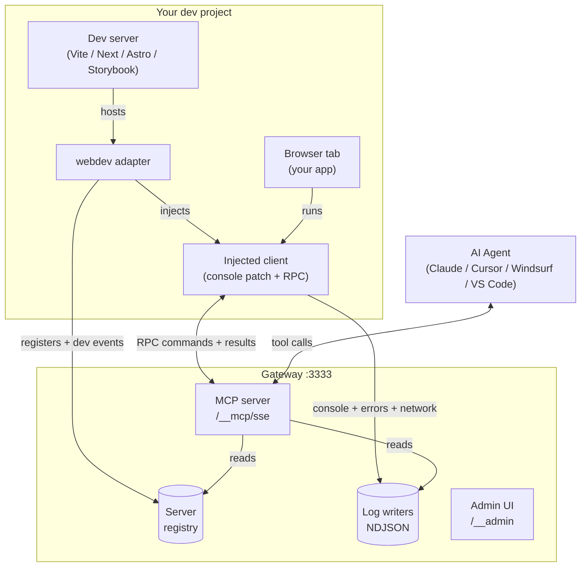
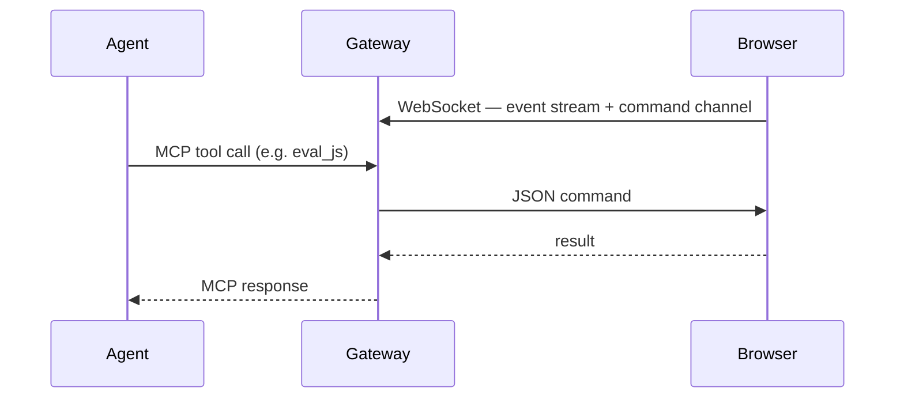

# Architecture

Three actors, one local gateway holding them together.

A single tool call flows like this:

The injected client script:
- Patches `console.*`, `fetch`, `XMLHttpRequest` to relay events to NDJSON log files
- Connects to `/__rpc` via WebSocket for JSON commands
- Handles commands: eval, screenshot, click, fill, navigate, queryDom, markdown, etc.

When the Chrome extension is installed, `browser_*` tools upgrade transparently to Playwright via CDP — pixel-perfect screenshots and reliable locators, transparent to the agent.
