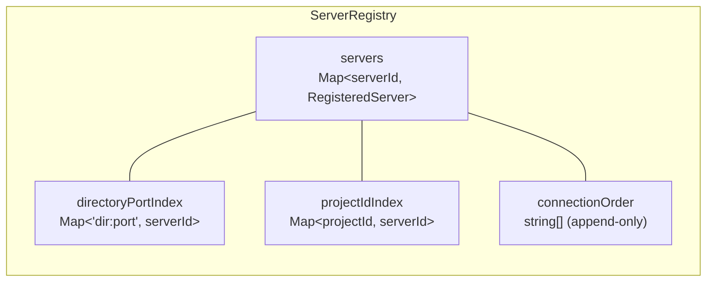
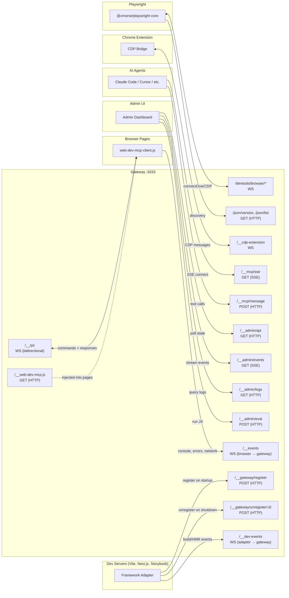
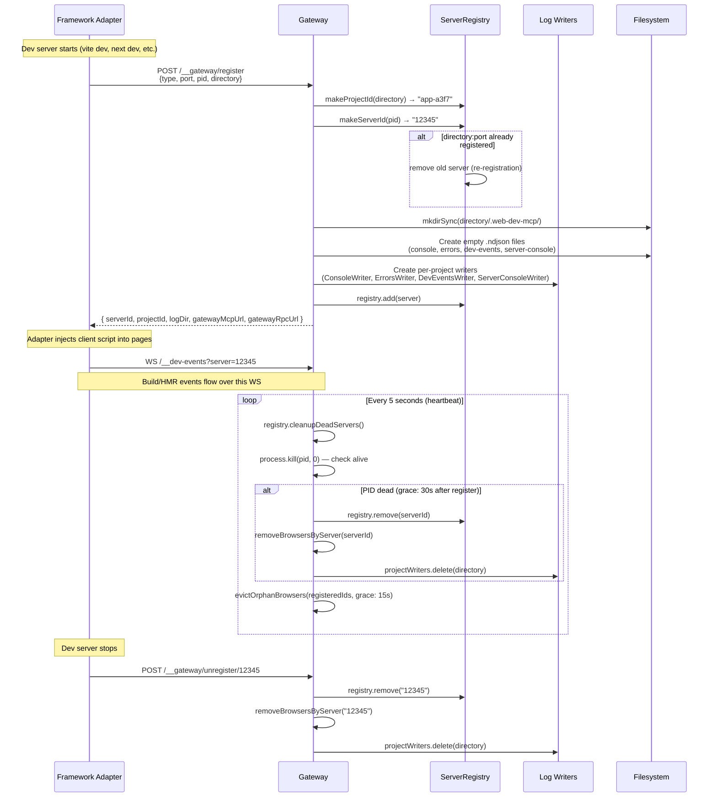
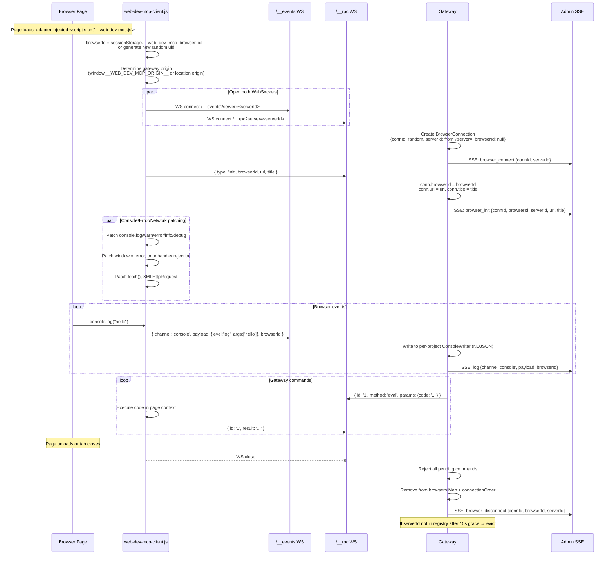
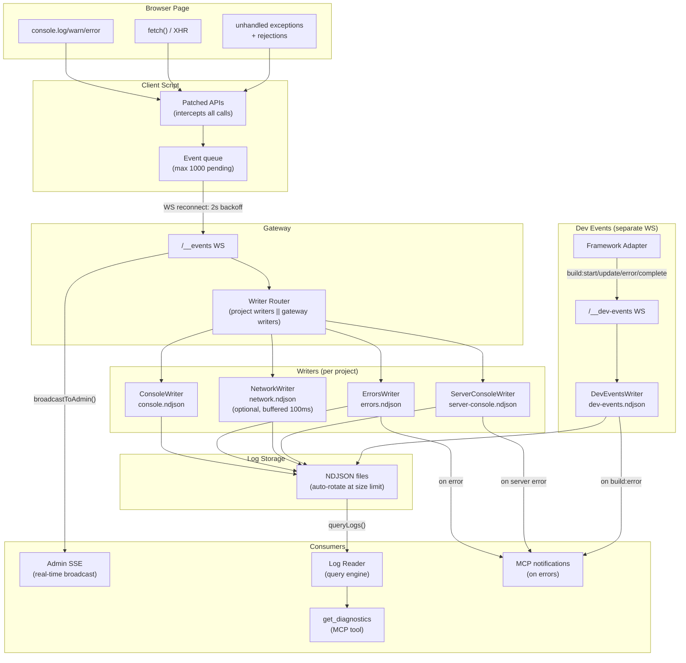

# web-dev-mcp Gateway Architecture

## Entity Model

```mermaid
erDiagram
    GATEWAY ||--o{ PROJECT : "tracks"
    GATEWAY ||--o{ MCP_SESSION : "hosts"
    GATEWAY ||--o| CDP_RELAY : "owns"
    PROJECT ||--|{ SERVER : "has instances"
    SERVER ||--o{ BROWSER : "connected to"
    CDP_RELAY ||--o{ AVAILABLE_TAB : "knows about"
    CDP_RELAY ||--o{ PLAYWRIGHT_CLIENT : "serves"

    GATEWAY {
        string serverUrl "http://localhost:3333"
        string sessionId "sha256(serverUrl)[0:6]"
        string logDir ".web-dev-mcp/"
        number startedAt "Date.now()"
        number checkpointTs "null | timestamp"
        string mode "hub | hybrid"
    }

    PROJECT {
        string projectId "basename-hash4 (e.g. vite-app-a3f7)"
        string directory "absolute path (identity)"
        string logDir "directory/.web-dev-mcp/"
    }

    SERVER {
        string id "PID string (ephemeral)"
        string projectId "FK to Project"
        string directory "FK to Project"
        string type "vite | nextjs | storybook | generic"
        number port "dev server port"
        number pid "process ID"
        string name "optional friendly name"
        string rpcEndpoint "ws://localhost:PORT/__rpc"
        string mcpEndpoint "http://localhost:PORT/__mcp/sse"
        object logPaths "channel -> file path"
        number registeredAt "timestamp"
    }

    BROWSER {
        string connId "random uid (connection identity)"
        string browserId "random uid from client (sticky per tab)"
        string serverId "FK to Server (nullable)"
        string url "current page URL"
        string title "current page title"
        number connectedAt "timestamp"
        number nextId "command sequence counter"
    }

    MCP_SESSION {
        string sessionId "per-transport"
        string toolset "core (9) | full (23)"
        string currentProject "resolved project dir (nullable)"
    }

    CDP_RELAY {
        boolean debuggingActive "debugger attached?"
        boolean debuggingRequested "request sent?"
        number idleTimeoutMs "5min default"
    }

    AVAILABLE_TAB {
        number tabId "Chrome tab ID"
        string url "page URL"
        string serverId "associated server"
        string projectId "associated project"
    }

    PLAYWRIGHT_CLIENT {
        string clientId "incrementing int"
        boolean subscribedToAll "Target.setAutoAttach called?"
    }
```



### Identity Schemes

| Entity | Identity | Generated by | Lifetime |
|--------|----------|--------------|----------|
| Project | `basename-hash4` from absolute dir path | `makeProjectId(directory)` | Persistent (directory exists) |
| Server | PID string | `makeServerId(pid)` | Ephemeral (process lifetime) |
| Browser | `connId` (random, per WS) + `browserId` (random, per sessionStorage) | Client: `connId` at WS open, `browserId` from `sessionStorage.__web_dev_mcp_browser_id__` | Connection lifetime / tab lifetime |
| MCP Session | Transport sessionId | MCP SDK | SSE connection lifetime |

### Registry Indices

The `ServerRegistry` maintains three indices for fast lookup:



- `directoryPortIndex` prevents duplicate registrations for the same dir+port (re-registration replaces)
- `projectIdIndex` enables lookup by short ID (e.g. `vite-app-a3f7`)
- `connectionOrder` tracks registration order for "latest server" semantics

---

## Communication Protocols



### Protocol Details

| Connection | Transport | Direction | Message Format |
|-----------|-----------|-----------|----------------|
| Adapter → Register | HTTP POST | Adapter → Gateway | `{ type, port, pid, directory, rpcEndpoint?, mcpEndpoint? }` |
| Browser → Events | WebSocket | Browser → Gateway | `{ channel, payload, browserId }` |
| Browser ↔ RPC | WebSocket | Bidirectional | Gateway→Browser: `{ id, method, params }`, Browser→Gateway: `{ id, result }` or `{ id, error }` or `{ type: 'init', browserId, url, title }` |
| Adapter → Dev Events | WebSocket | Adapter → Gateway | `BuildEventPayload` (build:start, build:update, build:error, build:complete) |
| Admin → API | HTTP GET | Admin → Gateway | Response: `{ uptime_ms, mode, browsers[], servers[], mcp_sessions }` |
| Admin ← SSE | SSE | Gateway → Admin | Events: `browser_connect`, `browser_init`, `browser_disconnect`, `log` |
| Agent ↔ MCP | SSE + HTTP POST | Bidirectional | MCP protocol (JSON-RPC over SSE transport) |
| Extension ↔ CDP | WebSocket | Bidirectional | `tabAvailable`, `tabUnavailable`, `requestDebug`, `releaseDebug`, `forwardCDPEvent`, `forwardCDPCommand` |
| Playwright ↔ CDP | WebSocket | Bidirectional | Raw CDP protocol (proxied through relay) |

---

## Server Registration Lifecycle



---

## Browser Connection Lifecycle



### Orphan Browser Handling

Browsers are "orphans" when their `serverId` doesn't match any registered server. This happens when:
- A dev server crashes without unregistering
- Gateway restarts but servers haven't re-registered yet
- Browser tabs from old dev sessions reconnect

Rules:
- Browsers with **no serverId** (untagged) are never evicted — they're valid gateway-level connections
- Browsers with a **stale serverId** get evicted after 15-second grace period
- Grace period prevents false evictions during gateway restart (servers re-register within seconds)

---

## Log Data Flow



### NDJSON Event Format

Every log entry on disk:

```json
{"id": 1, "ts": 1713400000000, "channel": "console", "payload": {"level": "log", "args": ["hello world"]}}
```

| Field | Type | Description |
|-------|------|-------------|
| `id` | number | Monotonic per writer (resets on rotation) |
| `ts` | number | `Date.now()` at write time |
| `channel` | string | `console`, `errors`, `dev-events`, `server-console`, `network` |
| `payload` | object | Channel-specific (see below) |

### Payload Shapes

| Channel | Payload Type | Fields |
|---------|-------------|--------|
| `console` | ConsolePayload | `level` (log/warn/error/info/debug), `args` (string[], truncated at 2000 chars), `stack?` |
| `errors` | ErrorPayload | `type` (console-error/unhandled-exception/unhandled-rejection), `message`, `stack?`, `file?`, `line?` |
| `network` | NetworkPayload | `method`, `url`, `status`, `duration`, `initiator` (fetch/xhr) |
| `server-console` | ServerConsolePayload | `level`, `args`, `source: 'server'`, `stack?` |
| `dev-events` | BuildEventPayload | `type` (build:start/update/error/complete), `error?`, `modules?` |

### Log Query Engine

`queryLogs()` reads NDJSON files with filtering:

```
queryLogs(files, { channel?, sinceId?, limit (max 200)?, level?, search?, browserId? })
→ { events[], total, returned, next_cursor }
```

`getDiagnostics()` queries all 4 channels + build status → `DiagnosticsResult`:
```
{ build: BuildStatus, logs: { console, errors, network, server_console }, summary: DiagnosticSummary, checkpoint_ts }
```

### Writer Rotation

Writers auto-rotate NDJSON files at a configurable size limit (`maxFileSizeMb`, default unset). Rotation scheme: `.ndjson` → `.1.ndjson` → `.2.ndjson` → `.3.ndjson` (max 3 rotated files).

### SSE Replay Buffer

Admin SSE has a 1MB in-memory replay buffer for `Last-Event-ID` reconnection:
- Each event gets monotonic `id` (sseSeq)
- Buffer evicts entries all connected clients have received
- Hard cap at 1MB regardless of client state (protects against slow/stale clients)
- Events: `connected`, `browser_connect`, `browser_init`, `browser_disconnect`, `log`

---

## Current Admin UI (to be replaced)

The existing admin at `examples/admin-svelte/` consumes these gateway endpoints:

| What it does | Endpoint | Transport |
|-------------|----------|-----------|
| Load full state (projects, servers, browsers) | `GET /__admin/api` | HTTP |
| Stream live events | `GET /__admin/events` | SSE |
| Query historical logs | `GET /__admin/logs` | HTTP |
| Execute JS in browser | `POST /__admin/eval` | HTTP |

### Known Issues

1. **Log-centric** — main view is a log stream, not a system overview
2. **Confusing sidebar** — hash suffixes on project IDs (`app-a3f7`), ports everywhere
3. **Orphan browsers** — show up in `__unknown` section with no explanation
4. **Clear doesn't persist** — UI clears local state, but server still has logs (no `POST /__admin/logs/clear` endpoint)
5. **No server lifecycle SSE events** — admin only learns about server changes via polling `/__admin/api`
6. **SSE 6-connection limit** — browsers have a hard limit on concurrent SSE connections per domain, problematic when running multiple apps
