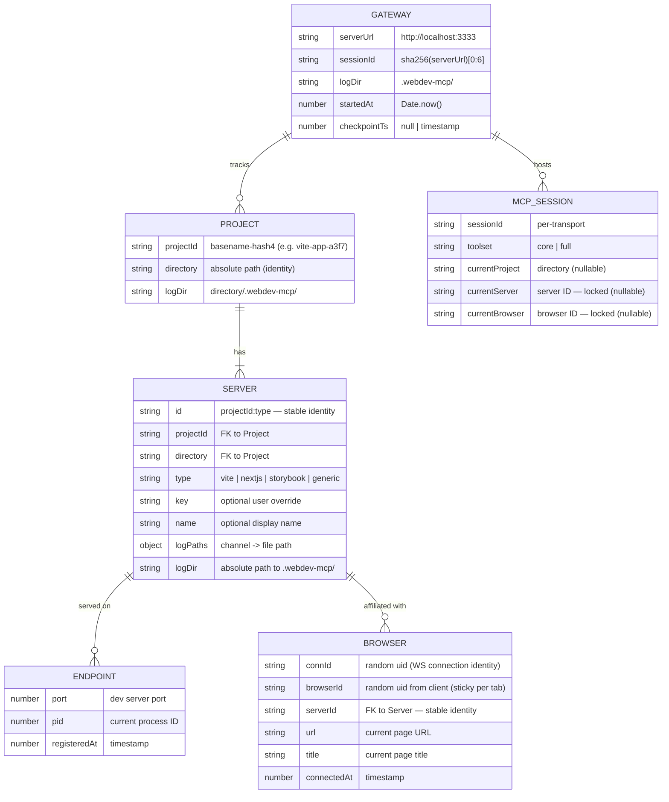
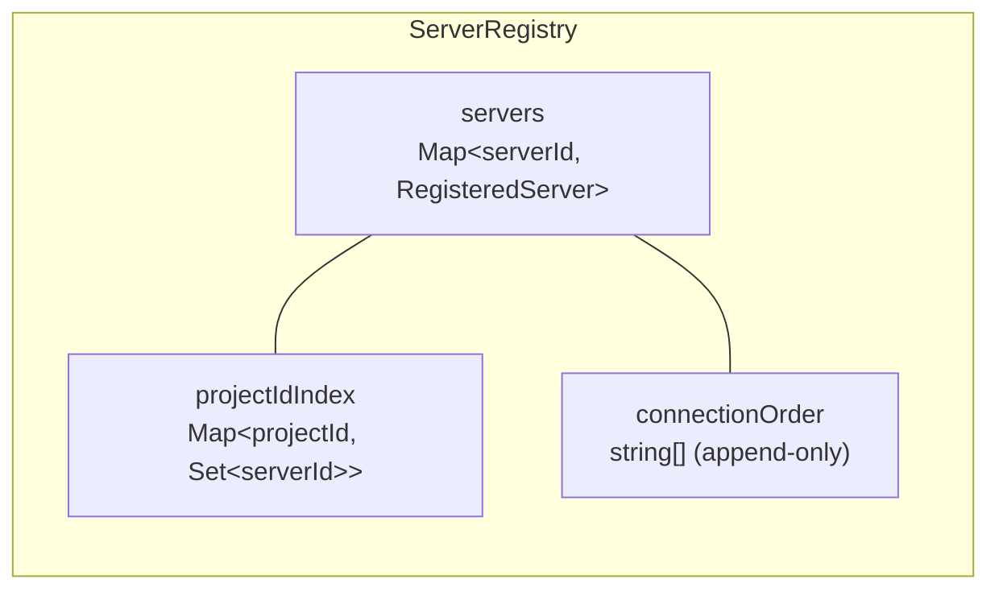
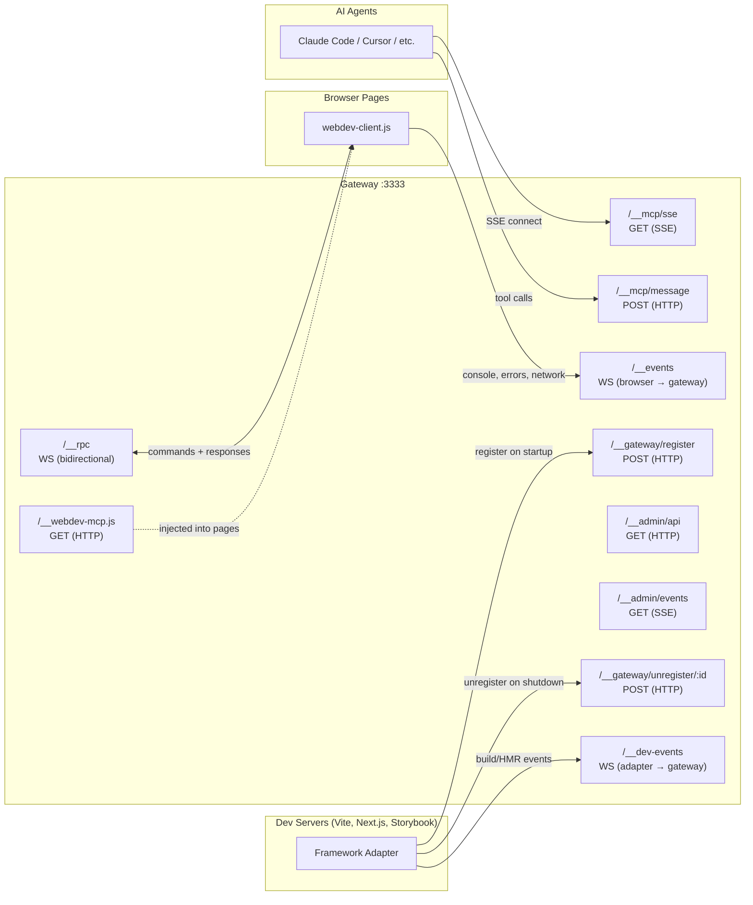
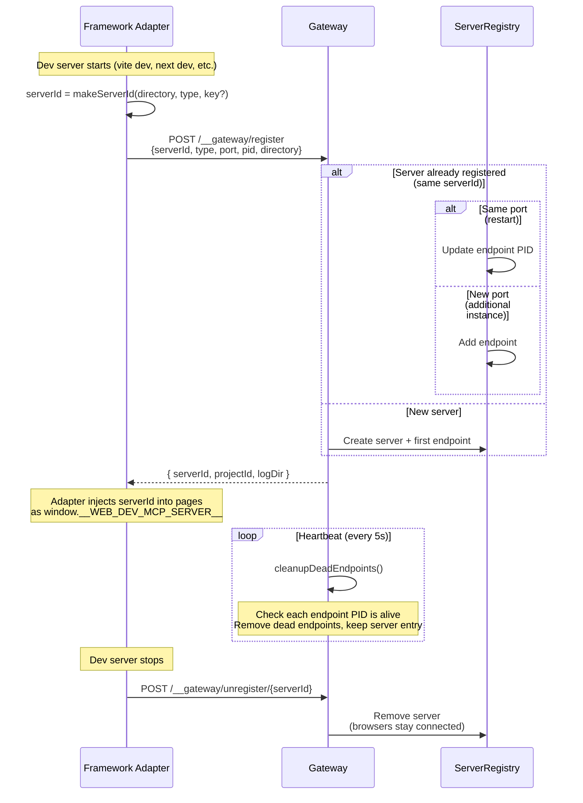
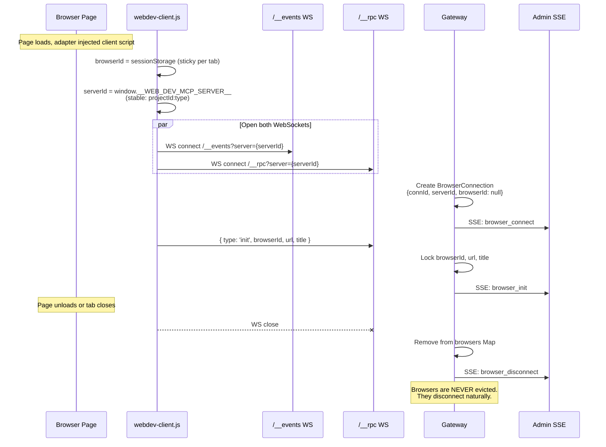
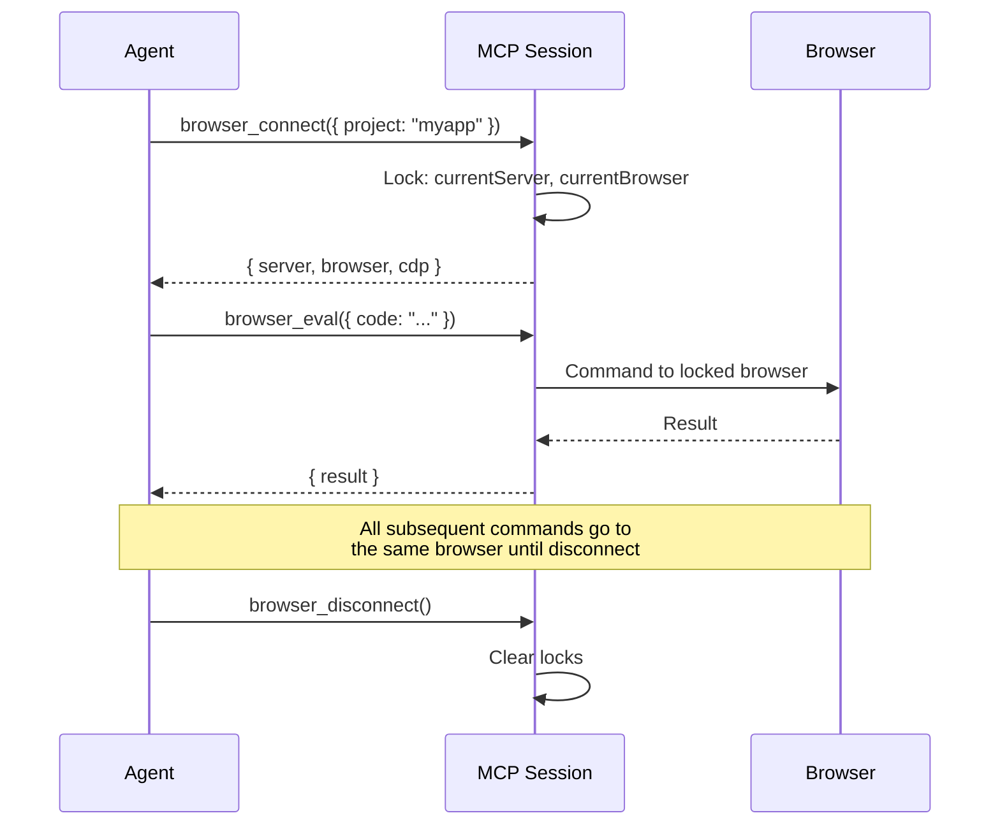
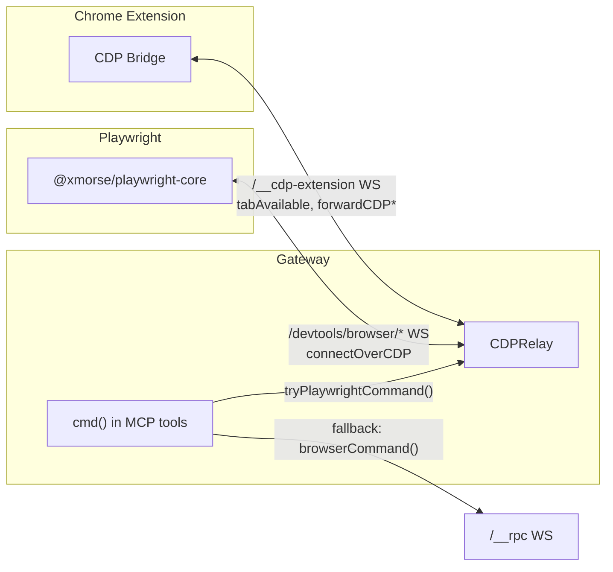
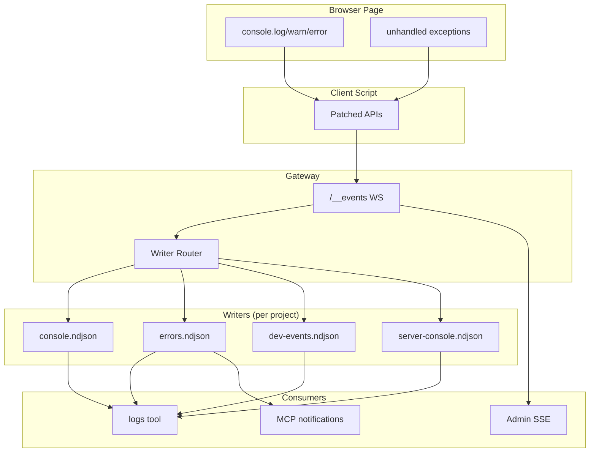

# webdev Gateway Architecture

## Entity Model



### Identity Schemes

| Entity | Identity | Generated by | Lifetime |
|--------|----------|--------------|----------|
| Project | `basename-hash4` from absolute dir path | `makeProjectId(directory)` | Persistent (directory exists) |
| Server | `projectId:type` (or `projectId:key`) | `makeServerId(directory, type, key?)` | Stable across restarts |
| Endpoint | port number | From adapter registration | Process lifetime |
| Browser | `connId` (random, per WS) + `browserId` (random, per sessionStorage) | Client | Connection / tab lifetime |
| MCP Session | Transport sessionId | MCP SDK | SSE connection lifetime |

### Key Design Decisions

1. **Server identity is stable** — `projectId:type` survives PID changes, port changes, and restarts. Browsers bind to the server, not to a process or port.

2. **Multiple endpoints per server** — a server can be served on multiple ports (e.g. Vite took 5174 because 5173 was busy). Each endpoint has a current PID that can rotate.

3. **No browser eviction** — browsers are never forcibly disconnected. They disconnect naturally when tabs close. A browser with a valid server affiliation is always valid, even if no endpoint is currently live.

4. **MCP session locking** — `browser_connect` locks the session to a specific server + browser. Subsequent commands go to that exact browser until it disconnects or the agent explicitly switches.

### Registry Indices



- `servers` indexed by stable server ID (`projectId:type`)
- `projectIdIndex` enables lookup by short ID — returns all servers for that project
- `connectionOrder` tracks registration order for "latest server" semantics

---

## Communication Protocols



### Protocol Details

| Connection | Transport | Direction | Message Format |
|-----------|-----------|-----------|----------------|
| Adapter → Register | HTTP POST | Adapter → Gateway | `{ serverId, type, port, pid, directory, key? }` |
| Browser → Events | WebSocket | Browser → Gateway | `{ channel, payload, browserId }` |
| Browser ↔ RPC | WebSocket | Bidirectional | Gateway→Browser: `{ id, method, params }`, Browser→Gateway: `{ id, result }` or `{ id, error }` or `{ type: 'init', browserId, url, title }` |
| Agent ↔ MCP | SSE + HTTP POST | Bidirectional | MCP protocol (JSON-RPC over SSE transport) |

---

## Server Registration Lifecycle



---

## Browser Connection Lifecycle



### Browser Affiliation

- Browser connects with stable `serverId` (projectId:type), NOT a PID
- If the dev server restarts (new PID, possibly new port), the browser's affiliation is still valid
- Browser reconnects automatically (2s backoff) — same serverId, same affiliation
- No `__unknown` state — browser always has a valid server affiliation

---

## MCP Tool Surface

### Core Tools (always loaded)

| Tool | Description |
|------|-------------|
| `browser_connect` | Lock session to a server + browser |
| `browser_disconnect` | Release session locks |
| `browser_list` | List connected browsers |
| `browser_projects` | List registered servers/projects |
| `browser_debug` | Start/stop CDP debugging |
| `browser_eval` | Run JS in browser |
| `browser_screenshot` | Take screenshot |
| `browser_a11y_snapshot` | Accessibility tree with ref IDs |
| `browser_query` | Query DOM elements |
| `logs` | Get/clear project logs |

### Full Tools (added with `?tools=full`)

| Tool | Description |
|------|-------------|
| `browser_click` | Click element (CSS, text=, ref=) |
| `browser_fill` | Fill input |
| `browser_select` | Select option |
| `browser_hover` | Hover element |
| `browser_key` | Press key |
| `browser_navigate` | Navigate to URL |
| `browser_back` | History back |
| `browser_forward` | History forward |
| `browser_scroll` | Scroll |
| `browser_text` | Get visible text |
| `browser_markdown` | Page as markdown |
| `browser_wait` | Poll condition |

### Session Locking



---

## CDP Relay (Playwright Integration)

When the Chrome extension is installed and connected, browser commands auto-upgrade from injected client RPC to Playwright API (pixel-perfect screenshots, reliable locators, `ref=` targeting from a11y snapshots).



### CDP Flow

1. Extension detects dev pages via `<meta name="webdev-mcp">` tag
2. Extension announces tabs to gateway via `tabAvailable` messages
3. Agent calls `browser_debug({ action: "start" })` — gateway sends `requestDebug` to extension
4. Extension attaches `chrome.debugger`, starts forwarding CDP events
5. Playwright connects via `connectOverCDP` to `/devtools/browser/*`
6. All `browser_*` tools now route through Playwright (transparent to agent)
7. After idle timeout (5min), gateway sends `releaseDebug` — debugger detaches

### Endpoints

| Endpoint | Transport | Purpose |
|----------|-----------|---------|
| `/__cdp-extension` | WebSocket | Extension ↔ relay protocol |
| `/devtools/browser/*` | WebSocket | Playwright `connectOverCDP` |
| `/json/version` | HTTP GET | Playwright discovery (browser info) |
| `/json/list` | HTTP GET | Playwright discovery (target list) |

---

## Gateway URL Auto-Detection

Remote devices (phones on tailnet/LAN) need to reach the gateway. Two mechanisms:

1. **Relative script loading** — Vite adapter loads `/__webdev-mcp.js` from vite's own origin (relative URL), not from the absolute gateway URL. Vite serves it via middleware.

2. **Hostname rewrite** — Client script detects when page hostname differs from injected gateway hostname. If page is on `100.67.86.117:5173` but gateway was injected as `localhost:3333`, client rewrites to `100.67.86.117:3333`.

```
Page loaded from: http://100.67.86.117:5173
Injected gateway: http://localhost:3333
Client rewrites:  http://100.67.86.117:3333  ← used for WS connections
```

---

## Log Data Flow



### NDJSON Format

```json
{"id": 1, "ts": 1713400000000, "channel": "console", "payload": {"level": "log", "args": ["hello"]}}
```

### Channels

| Channel | Source | Payload |
|---------|--------|---------|
| `console` | Browser `console.*` | `{ level, args[], stack? }` |
| `errors` | Unhandled exceptions/rejections, console.error | `{ type, message, stack?, file?, line? }` |
| `server-console` | Dev server stdout (via adapter) | `{ level, args[], source: 'server' }` |
| `dev-events` | Build/HMR events (via adapter) | `{ type: 'build:start\|update\|error\|complete', error?, modules? }` |
| `network` | fetch/XHR (optional) | `{ method, url, status, duration, initiator }` |

---

## Admin Endpoints

| Endpoint | Method | Purpose |
|----------|--------|---------|
| `/__admin/api` | GET | Full state: servers, browsers, uptime |
| `/__admin/events` | GET (SSE) | Real-time: browser_connect, browser_init, browser_disconnect, log |
| `/__admin/logs` | GET | Query historical logs |
| `/__admin/eval` | POST | Execute JS in a browser `{ code, serverId }` |
| `/__gateway/register` | POST | Register a dev server endpoint |
| `/__gateway/unregister/:id` | POST | Remove a dev server |
| `/__gateway/servers` | GET | List registered servers |
| `/__gateway/init` | GET | Client config (serverId, gatewayUrl) |
| `/__status` | GET | Gateway status + session info |
